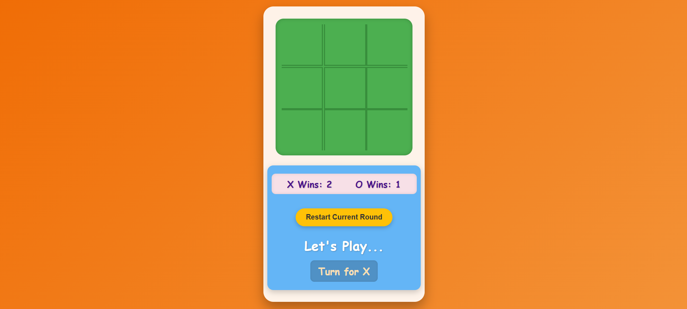

# 🚀 Tic-Tac-Toe Game 🚀

A classic Tic-Tac-Toe game with a fun twist! Compete against a friend in a series of rounds to see who can become the ultimate **Tic-Tac-Toe Champion!**

---

## ✨ Features

* **Classic Gameplay:** Enjoy the timeless game of Tic-Tac-Toe on a responsive board.
* **Dynamic Turns:** Clear indicators show whose turn it is.
* **Round Wins Tracking:** A scoreboard keeps track of how many rounds X and O have won.
* **Championship Mode:** The first player to reach **5 wins** is crowned the "CHAMPION!"
* **Draw Detection:** The game accurately identifies when a round ends in a draw.
* **Animated Visuals:** Smooth transitions and pop-in effects for moves and game-over states make the experience more engaging.
* **Responsive Design:** Adapts well to different screen sizes.
* **Easy Restart:**
    * **"Play Next Round"** button (after a win/draw) clears the board and continues the score.
    * **"Restart Current Round"** button lets you reset the current game without affecting the overall championship score.

---

## 🕹️ How to Play

1.  **Open `index.html`:** Simply open the `index.html` file in your web browser.
2.  **Take Turns:** Players "X" and "O" click on the empty cells to place their marks.
3.  **Win a Round:** Get three of your marks in a row (horizontally, vertically, or diagonally) to win the round.
4.  **Track Scores:** The scoreboard will update with each round win.
5.  **Become Champion:** The first player to reach 5 round wins is declared the champion!
6.  **Restart:**
    * Click **"Play Next Round"** on the game-over screen to start a new round and continue the championship.
    * Click **"Restart Current Round"** at any time to clear the board and start the current match over, without affecting the championship scores.

---

## 🛠️ Technologies Used

* **HTML5:** For the game structure.
* **CSS3:** For styling, animations, and responsive design.
* **JavaScript (ES6+):** For game logic, turn management, win/draw conditions, score tracking, and championship logic.

---

## 🚀 Getting Started

To get a local copy up and running, follow these simple steps:

1.  **Clone the repository:**
    ```bash
    git clone [https://github.com/vanshh13/Tic-Tac-Toe.git](https://github.com/vanshh13/Tic-Tac-Toe.git)
    ```

2.  **Navigate to the project directory:**
    ```bash
    cd Tic-Tac-Toe
    ```

3.  **Open the game:**
    Open the `index.html` file in your preferred web browser.

## 📸 Screenshots

### 🏠 Home Page
